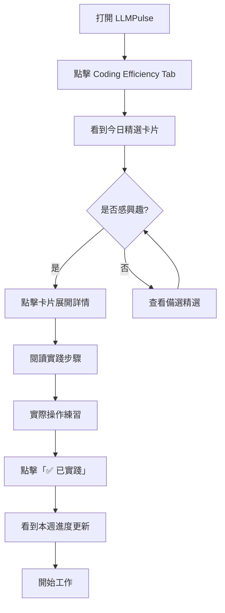
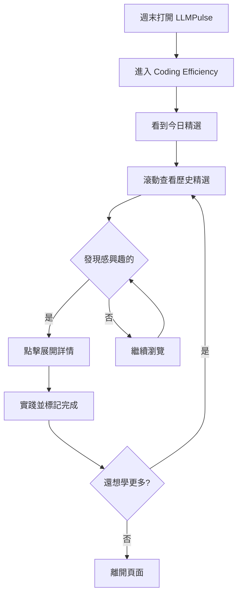
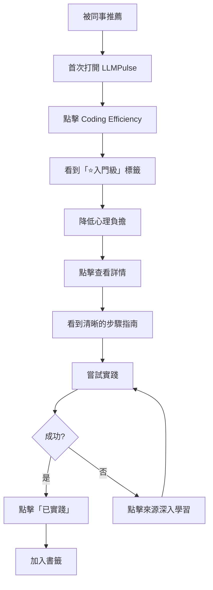

# UX Design Specification - LLMPulse

**Author:** alenryuichi
**Date:** 2026-01-11

---

## Executive Summary

### Project Vision

將 LLMPulse 的 Coding Efficiency 專區從「AI 編程資訊展示」升級為「AI Coding 每日行動指南」。

**核心價值主張：** 「每日一個 AI Coding 最佳實踐，可信來源，立即可用」

**范式轉變：** 從「信息聚合」到「行動指南」
- 傳統模式：新聞 → 閱讀 → 遺忘
- 新模式：精選 → 實踐 → 成長

### Target Users

| 用戶類型 | 畫像 | 核心需求 | 使用場景 |
|----------|------|----------|----------|
| **日常型** (小明) | 3年經驗全棧開發者 | 每日快速提升 AI 編程效率 | 早上 8:45 開工前 5 分鐘 |
| **批量型** (小紅) | 技術團隊 Lead | 週末補課 + 團隊分享 | 週末下午集中學習 |
| **探索型** (小張) | 初級開發者 | 簡單入門，降低學習門檻 | 被推薦後首次訪問 |

### Key Design Challenges

1. **極簡首屏體驗** - 用戶在 2 分鐘內必須看到並理解今日精選
2. **行動驅動設計** - 從「被動閱讀」轉變為「主動實踐」
3. **跨設備一致性** - 支持 Mobile/Tablet/Desktop 響應式體驗
4. **與現有系統融合** - 無縫融入現有 LLMPulse 設計語言

### Design Opportunities

1. **習慣形成設計** - 透過成就感和進度追蹤培養每日訪問習慣
2. **漸進式揭示** - 根據用戶層級提供不同深度的內容展示
3. **情感設計** - 「已實踐」成就感、連續打卡滿足感

## Core User Experience

### Defining Experience

**核心循環：** 打開頁面 → 查看今日精選 → 閱讀步驟 → 標記已實踐

**核心行動：** 「首屏即價值」— 用戶打開頁面的瞬間必須立刻看到今日精選卡片

**成功定義：** 從打開頁面到理解「今天我該練什麼」必須 < 30 秒

### Platform Strategy

| 維度 | 決策 |
|------|------|
| 平台 | Web SPA (React 19 + TypeScript) |
| 響應式 | Mobile-first，支持 Tablet/Desktop |
| 交互模式 | 觸控優先，兼容鍵鼠 |
| 離線支持 | LocalStorage 緩存今日精選 |

### Effortless Interactions

| 交互 | 設計目標 |
|------|----------|
| 發現今日精選 | 打開頁面立刻可見，無需滾動 |
| 理解價值 | 難度 + 時間 + 來源一目了然 |
| 開始實踐 | 點擊展開步驟指南 |
| 標記完成 | 一鍵「✅ 已實踐」立即反饋 |

### Critical Success Moments

1. **「正是我需要的」** - 今日精選的價值即時傳達
2. **「原來這麼簡單」** - 步驟清晰可執行
3. **「我有進步」** - 實踐計數帶來成就感
4. **首次用戶成功** - 入門門檻極低

### Experience Principles

1. **首屏即價值** - 用戶打開頁面瞬間就能看到今日精選
2. **一步到位** - 核心功能永遠只需一次點擊
3. **即時成就感** - 每次「已實踐」都有明確視覺反饋
4. **移動優先** - 所有設計先考慮手機場景

---

## Desired Emotional Response

### Primary Emotional Goals

| 情緒 | 描述 | 設計支持 |
|------|------|----------|
| **掌控感** | 用戶感覺自己在主導學習進度 | 清晰的進度指示、可預測的交互 |
| **成就感** | 每次實踐都有明確的「完成」反饋 | 視覺化的「✅ 已實踐」狀態變化 |
| **信任感** | 相信內容來源可靠、值得投入時間 | 明確展示來源、難度和時間估計 |
| **期待感** | 每天想回來看新內容 | 每日更新、新鮮感設計 |

### Emotional Journey Mapping

| 階段 | 期望情緒 | 設計策略 |
|------|----------|----------|
| **首次發現** | 好奇 → 釋然 → 認可 | 簡潔首屏、入門級標籤降低門檻 |
| **查看精選** | 期待 → 好奇 → 驚喜 | 吸引人的標題、清晰的價值說明 |
| **開始實踐** | 專注 → 自信 → 成就 | 清晰步驟、即時反饋 |
| **完成實踐** | 滿足 → 成就 → 期待 | 視覺慶祝、統計數據激勵 |
| **再次訪問** | 習慣 → 依賴 → 忠誠 | 一致的體驗、持續的價值 |

### Micro-Emotions

**需要強化的正向情緒：**
- ✅ 自信 (vs. 困惑) - 每個步驟都清晰明確
- ✅ 信任 (vs. 懷疑) - 可信來源、透明信息
- ✅ 成就 (vs. 挫敗) - 低門檻、高成功率
- ✅ 歸屬 (vs. 孤立) - 社群感、共同成長

**需要避免的負面情緒：**
- ❌ 信息過載焦慮
- ❌ 選擇困難症
- ❌ 時間浪費感
- ❌ 學習無效感

### Emotional Design Principles

1. **減少而非增加** - 每個界面只有一個核心任務
2. **即時反饋** - 所有交互都有明確的視覺/觸覺回應
3. **漸進披露** - 複雜信息按需展示，不一次性呈現
4. **慶祝成功** - 完成實踐時給予適度但不過分的正向反饋

---

## UX Pattern Analysis & Inspiration

### Inspiring Products Analysis

| 產品 | 優秀的 UX 模式 | 可借鑒之處 |
|------|----------------|------------|
| **Duolingo** | 每日打卡習慣設計、進度追蹤、成就系統 | 習慣形成機制、簡短學習單元 |
| **Medium Daily Digest** | 精選內容推送、閱讀時間估計 | 內容策展呈現方式 |
| **GitHub Trending** | 每日熱門項目展示、分類瀏覽 | 技術內容卡片設計 |
| **Notion** | 乾淨的信息層級、可展開的內容塊 | 內容組織和展開交互 |

### Transferable UX Patterns

**導航模式：**
- Tab 導航 (現有 LLMPulse 模式) - 保持一致性
- 卡片式內容展示 - 清晰的內容邊界

**交互模式：**
- 點擊展開/收起 - 漸進式信息披露
- 一鍵操作 - 最小化步驟的標記系統
- 滾動觸發加載 - 歷史精選的分頁

**視覺模式：**
- 標籤系統 (難度/時間) - 快速識別
- 進度指示器 - 成就感可視化
- 來源引用樣式 - 建立可信度

### Anti-Patterns to Avoid

| 反模式 | 問題 | 替代方案 |
|--------|------|----------|
| ❌ 彈窗干擾 | 打斷用戶流程 | 內聯展示所有信息 |
| ❌ 複雜的多級導航 | 增加認知負擔 | 扁平化結構 |
| ❌ 強制登錄 | 增加使用門檻 | LocalStorage 匿名追蹤 |
| ❌ 信息過載 | 選擇困難 | 每日僅推 1 主 + 2 備 |
| ❌ 缺乏反饋 | 操作不確定感 | 每個操作都有視覺反饋 |

### Design Inspiration Strategy

**採用 (Adopt)：**
- Duolingo 的每日習慣追蹤視覺
- Medium 的閱讀時間估計標籤
- GitHub 的卡片式內容布局

**適配 (Adapt)：**
- Notion 的展開/收起交互 → 簡化為兩級
- Duolingo 的成就系統 → 輕量化實踐計數

**避免 (Avoid)：**
- 複雜的遊戲化機制
- 社交分享強制流程
- 過度動畫效果

---

## Design System Foundation

### Design System Choice

**選擇：** Tailwind CSS (現有系統) + 自定義組件

**理由：**
1. **現有一致性** - LLMPulse 已使用 Tailwind CSS CDN
2. **快速開發** - 無需學習新系統
3. **足夠靈活** - 可自定義品牌視覺
4. **團隊熟悉** - 降低實施風險

### Implementation Approach

| 層級 | 來源 | 說明 |
|------|------|------|
| **基礎樣式** | Tailwind CSS 3.x | 間距、顏色、排版基礎 |
| **組件層** | 自定義 React 組件 | 今日精選卡片、步驟指南等 |
| **設計 Token** | CSS 變量 | 主題色、品牌色定義 |

### Customization Strategy

**需自定義的設計 Token：**
```css
:root {
  --color-primary: #6366f1;      /* Indigo - 主操作色 */
  --color-success: #22c55e;      /* Green - 已實踐狀態 */
  --color-warning: #f59e0b;      /* Amber - 中級難度 */
  --color-info: #3b82f6;         /* Blue - 入門難度 */
  --color-surface: #1e293b;      /* Slate - 卡片背景 */
}
```

---

## Detailed Defining Experience

### The Defining Interaction

> **「每日打開 → 30秒內看懂今日精選 → 5分鐘實踐 → 標記完成」**

這是用戶會向朋友描述的核心體驗循環。

### User Mental Model

**用戶預期：**
- 像查看天氣預報一樣簡單 - 打開就知道今天該做什麼
- 像 RSS 訂閱一樣 - 每天有新內容更新
- 像打卡 App 一樣 - 完成後有明確的記錄

**現有解決方案的問題：**
- 技術博客：內容太長，需要 30+ 分鐘
- Twitter/X：信息碎片化，難以行動
- 官方文檔：難以發現最新最佳實踐

### Success Criteria

| 指標 | 目標 | 衡量方式 |
|------|------|----------|
| 首屏理解時間 | < 10 秒 | 用戶能說出今日精選主題 |
| 開始實踐意願 | > 60% | 點擊查看詳情比例 |
| 完成實踐率 | > 40% | 標記「已實踐」比例 |
| 次日回訪率 | > 30% | D1 留存 |

### Experience Mechanics

**1. 進入 (Initiation):**
- 點擊「Coding Efficiency」Tab
- 首屏立即展示今日精選卡片
- 無需任何額外操作

**2. 互動 (Interaction):**
- 點擊卡片 → 展開步驟詳情
- 閱讀 1-2-3 步驟指南
- 可選：跳轉原始來源

**3. 反饋 (Feedback):**
- 卡片展開動畫 (200ms)
- 步驟有數字編號 (進度感)
- 來源鏈接明確可點擊

**4. 完成 (Completion):**
- 點擊「✅ 已實踐」按鈕
- 按鈕變為綠色勾選狀態
- 顯示「本週已實踐 X 個」

---

## Visual Design Foundation

### Color System

**主色調：** 延續 LLMPulse 現有暗色主題

| 用途 | 顏色 | Hex | 說明 |
|------|------|-----|------|
| **主操作** | Indigo | `#6366f1` | 主要按鈕、鏈接 |
| **成功/已完成** | Green | `#22c55e` | 已實踐狀態 |
| **入門級** | Blue | `#3b82f6` | 難度標籤 |
| **中級** | Amber | `#f59e0b` | 難度標籤 |
| **高級** | Red | `#ef4444` | 難度標籤 |
| **卡片背景** | Slate 800 | `#1e293b` | 內容區域 |
| **頁面背景** | Slate 900 | `#0f172a` | 整體背景 |
| **主文字** | Slate 100 | `#f1f5f9` | 標題、正文 |
| **次文字** | Slate 400 | `#94a3b8` | 輔助信息 |

### Typography System

| 層級 | 大小 | 權重 | 用途 |
|------|------|------|------|
| **H1** | 24px / 1.5rem | Bold (700) | 頁面標題 |
| **H2** | 20px / 1.25rem | Semi-bold (600) | 卡片標題 |
| **H3** | 16px / 1rem | Semi-bold (600) | 步驟標題 |
| **Body** | 14px / 0.875rem | Regular (400) | 正文內容 |
| **Caption** | 12px / 0.75rem | Regular (400) | 標籤、時間 |

**字體選擇：**
- 英文：Inter (現有)
- 中文：System UI (繼承)
- 代碼：JetBrains Mono (現有)

### Spacing & Layout Foundation

**基礎間距單位：** 4px

| Token | 值 | 用途 |
|-------|-----|------|
| `space-1` | 4px | 緊密間距 |
| `space-2` | 8px | 元素內間距 |
| `space-3` | 12px | 標籤間距 |
| `space-4` | 16px | 卡片內間距 |
| `space-6` | 24px | 區塊間距 |
| `space-8` | 32px | 大區塊間距 |

**卡片圓角：** 12px (lg)
**按鈕圓角：** 8px (md)

### Accessibility Considerations

| 要求 | 標準 | 實現 |
|------|------|------|
| 對比度 | WCAG AA (4.5:1) | 所有文字與背景對比 > 4.5:1 |
| 觸控目標 | 44x44px 最小 | 按鈕最小高度 44px |
| 焦點指示 | 可見 | 2px solid outline |
| 鍵盤導航 | 完整支持 | Tab 順序邏輯 |

---

## Design Direction Decision

### Chosen Direction

**極簡卡片式設計** - 專注於內容呈現，最小化視覺干擾

### Design Rationale

1. **與現有 LLMPulse 一致** - 保持品牌統一性
2. **移動優先** - 卡片在小屏幕上表現優異
3. **內容為王** - 視覺服務於內容，不喧賓奪主
4. **快速掃描** - 支持用戶快速理解並決策

### Layout Structure

```
┌────────────────────────────────────┐
│  🔥 今日精選                        │
├────────────────────────────────────┤
│  ┌─────────────────────────────┐   │
│  │  ⭐入門 | ⏱️ 2分鐘          │   │
│  │  Claude: 使用 /compact      │   │
│  │  優化長對話                   │   │
│  │  📖 Anthropic Docs          │   │
│  │  [✅ 已實踐]                 │   │
│  └─────────────────────────────┘   │
│                                    │
│  📋 更多精選 (2)                   │
│  ┌────────────┐ ┌────────────┐    │
│  │  備選 1    │ │  備選 2    │    │
│  └────────────┘ └────────────┘    │
│                                    │
│  📚 歷史精選                       │
│  [最近 7 天的精選列表...]          │
└────────────────────────────────────┘
```

---

## User Journey Flows

### Journey 1: 每日晨間實踐 (小明)



### Journey 2: 週末補課 (小紅)



### Journey 3: 首次發現 (小張)



### Flow Optimization Principles

1. **最短路徑到價值** - 從打開到看到精選 < 2 步
2. **容錯設計** - 任何步驟都可回退
3. **漸進深入** - 簡單看 → 詳細看 → 來源看
4. **持續激勵** - 每個完成都有正向反饋

---

## Component Strategy

### Design System Components (Tailwind)

**直接使用：**
- 按鈕樣式 (Button variants)
- 標籤樣式 (Badge/Tag)
- 卡片容器 (Card container)
- 圖標系統 (Font Awesome - 現有)

### Custom Components

#### 1. DailyPracticeCard (今日精選卡片)

**用途：** 展示今日精選的主要內容

**組成：**
- 難度標籤 (⭐入門/中級/高級)
- 時間估計 (⏱️ X分鐘)
- 標題 (H2)
- 來源信息 (📖 Source)
- 實踐按鈕 (✅ 已實踐)

**狀態：**
- Default: 未實踐
- Expanded: 展開詳情
- Completed: 已實踐 (綠色邊框)

#### 2. PracticeSteps (實踐步驟)

**用途：** 展示具體的實踐步驟

**組成：**
- 步驟編號 (1, 2, 3...)
- 步驟描述
- 可選代碼塊

#### 3. DifficultyBadge (難度標籤)

**用途：** 顯示精選難度

**變體：**
- Beginner (藍色): ⭐ 入門
- Intermediate (橙色): ⭐⭐ 中級
- Advanced (紅色): ⭐⭐⭐ 高級

#### 4. PracticeButton (實踐按鈕)

**用途：** 標記實踐完成狀態

**狀態：**
- Unpracticed: 「標記已實踐」(灰色)
- Practiced: 「✅ 已實踐」(綠色)

#### 5. HistoryList (歷史列表)

**用途：** 展示過去 7-14 天的精選

**功能：**
- 按日期分組
- 顯示實踐狀態
- 點擊展開詳情

### Implementation Roadmap

**Phase 1 (MVP):**
- DailyPracticeCard
- PracticeSteps
- DifficultyBadge
- PracticeButton

**Phase 2 (Growth):**
- HistoryList
- WeeklyStats (週統計)

---

## UX Consistency Patterns

### Button Hierarchy

| 類型 | 樣式 | 用途 |
|------|------|------|
| **Primary** | 填充 Indigo | 主要操作 (標記已實踐) |
| **Secondary** | 邊框 Slate | 次要操作 (查看來源) |
| **Ghost** | 無邊框 | 文字鏈接 |

### Feedback Patterns

| 狀態 | 視覺表現 | 持續時間 |
|------|----------|----------|
| **成功** | 綠色 + ✅ 圖標 | 永久 (狀態變更) |
| **加載中** | Skeleton + 脈動動畫 | 直到加載完成 |
| **錯誤** | 紅色邊框 + 錯誤信息 | 直到重試成功 |
| **空狀態** | 插圖 + 說明文字 | 永久 |

### Interaction Patterns

| 交互 | 反饋 |
|------|------|
| **點擊卡片** | 展開動畫 (200ms ease-out) |
| **標記實踐** | 按鈕狀態切換 + 數字更新 |
| **滾動加載** | 底部 Skeleton 出現 |
| **錯誤恢復** | Toast 提示 + 重試按鈕 |

### Navigation Patterns

- **Tab 導航：** 保持 LLMPulse 現有模式
- **卡片展開：** 原地展開，不跳轉頁面
- **外部鏈接：** 新 Tab 打開來源

---

## Responsive Design & Accessibility

### Responsive Strategy

#### Mobile (< 640px)

- 單列卡片布局
- 底部操作按鈕 (觸控友好)
- 精簡信息展示
- 觸控目標 ≥ 44px

#### Tablet (640px - 1024px)

- 雙列備選卡片
- 側邊留白增加
- 完整信息展示

#### Desktop (> 1024px)

- 保持現有 LLMPulse 布局
- 今日精選居中突出
- 更多信息密度可接受

### Breakpoint Strategy

```css
/* Mobile-first */
.card { width: 100%; }

@media (min-width: 640px) {
  .card-grid { grid-template-columns: 1fr 1fr; }
}

@media (min-width: 1024px) {
  .container { max-width: 1200px; }
}
```

### Accessibility Strategy

**WCAG 2.1 Level AA 合規**

| 類別 | 要求 | 實現 |
|------|------|------|
| **感知** | 顏色對比 4.5:1 | 所有文字對比檢測通過 |
| **操作** | 鍵盤可訪問 | Tab/Enter/Space 完整支持 |
| **理解** | 一致的導航 | 相同操作相同結果 |
| **健壯** | 語義 HTML | article, button, nav 正確使用 |

### Implementation Guidelines

**語義化 HTML：**
```html
<article class="practice-card">
  <header>
    <span class="badge">⭐ 入門</span>
    <h2>標題</h2>
  </header>
  <section class="steps">...</section>
  <footer>
    <button type="button">✅ 已實踐</button>
  </footer>
</article>
```

**ARIA 標籤：**
- `aria-expanded` 用於可展開內容
- `aria-pressed` 用於切換按鈕
- `aria-label` 用於圖標按鈕

---

## Workflow Completion

### Summary

🎉 **UX 設計規格已完成！**

本文檔為 LLMPulse Coding Efficiency「今日精選」功能提供了完整的 UX 設計指導，包括：

- ✅ 專案理解與用戶洞察
- ✅ 核心體驗與情感設計
- ✅ UX 模式分析與靈感來源
- ✅ 設計系統選擇與策略
- ✅ 視覺設計基礎 (顏色、字體、間距)
- ✅ 用戶旅程流程設計
- ✅ 組件策略與規格
- ✅ UX 一致性模式
- ✅ 響應式設計與無障礙策略

### Next Steps

**建議的後續步驟：**

1. **Wireframe 生成** - 基於本規格創建詳細線框圖
2. **交互原型** - 構建可點擊原型進行用戶測試
3. **技術架構** - 解決方案架構設計
4. **開發實施** - 根據組件策略開始前端開發

**文件位置：** `_bmad-output/planning-artifacts/ux-design-specification.md`

